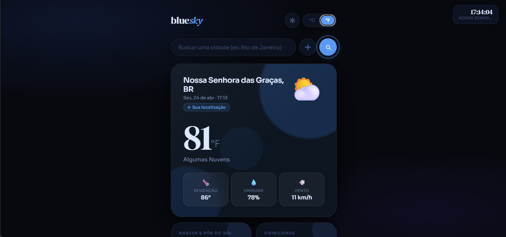
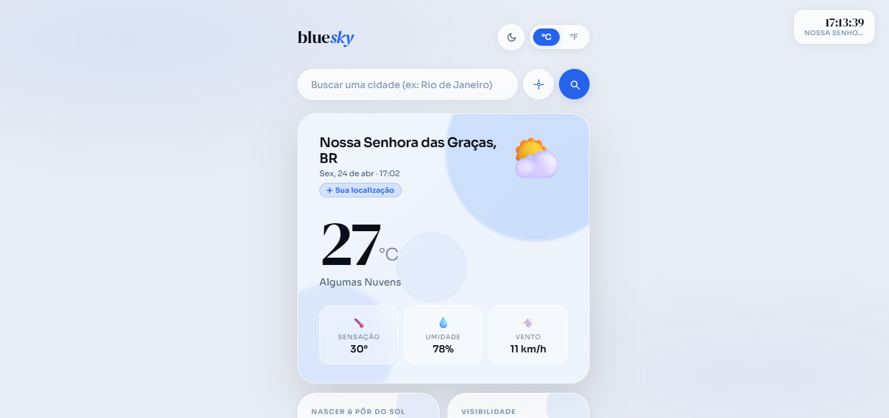
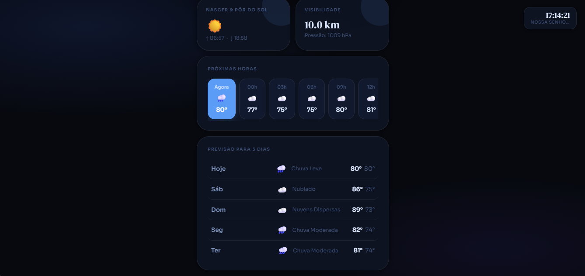

Blue Sky

Esse projeto é uma aplicação web que fiz para pessoas olharem o clima e temperatura de onde moram de forma dinamica, foi meu um projeto complicado de codar e difícil e o terceiro de todos.

A ideia foi criar algo que eu mesmo usaria no dia a dia, de forma completa e automatizada.

O que dá pra fazer

Criar treinos
Analisar o clima
temperaturas em graus e fr
previsao do tempo de dias e horas
relogio dinamico
Alternar entre modo claro e escuro
Os dados ficam salvos no navegador e nunca se perdem
✅

HTML
CSS
JavaScript (puro)
API

Pré-visualização

Acessar o projeto

 https://bryanfellas.github.io/bluesky/

Rodar localmente

git clone  https://bryanfellas.github.io/bluesky/.git
cd clima1
Depois é só abrir o index.html.

Fiz esse projeto pra treinar uso de APIs e CSS. 
